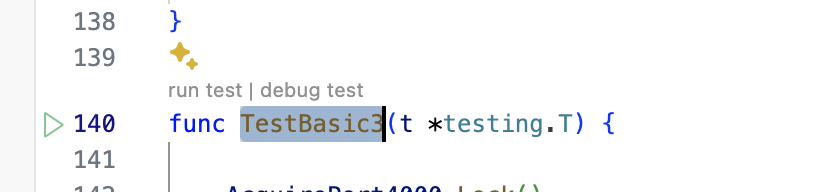

## How to install quanta for local development.

Since this is a programmers product we will install it a programmers way. In a terminal window.

### Install brew if you haven't yet.

see: https://brew.sh/

```
/bin/bash -c "$(curl -fsSL https://raw.githubusercontent.com/Homebrew/install/HEAD/install.sh)"
```

And now that we have a package manager we can
### Install and start consul.
```
brew install consul
```

And then, in a new terminal window start consul.
```
consul agent -dev
```

We will need to keep consul running in the background. 

#### An easy way to start consul on every reboot. Optional.
```
brew tap homebrew/services
brew services start consul agent -dev
```

### Install git.
If git is not already installed.
```
brew install git
```

### Install Go.
If Go is not already installed.
```
brew install go@1.22
```

### Get the code. 

if you have not already done so let's get the code. 
Open a terminal window to whatever you use as a workspace directory.
Then
```
git clone https://github.com/disney/quanta.git 
git checkout develop
```
and
```
cd quanta
```

### Run unit tests. 
```
make test
```
or
```
./test/run-go-tests.sh
```
### Running the integration tests:
This takes a long time.
```
make test-integration
```
or
```
./test/run-go-integration-tests.sh
```

### How to start a local quanta system. 

Make sure that consul is started and that the unit tests run. 
Start the server like this:
```
go run ./start-local/local-cluster-main.go
``` 
#### Adding schema to a local quanta cluster

tbd

#### Running mysql queries against local quanta cluster

tbd

### Debugging a test of cluster operation

(install VS Code)
(be sure consul is running)

In VS Code. Navigate to the root of your project in a terminal window.
Start VS Code:  `code .`

In VS Code navigate to the function `TestBasic3` in `local3+1_test.go`
If Go and everything is installed it should look like this:



Click on 'debug test'. 

Most all of quanta and it's libraries can have breakpoints and code can be traced.
Hoever too much time spend with threads paused in a breakpoint will cause Nodes to time out
so sometimes it's not possible to resume.